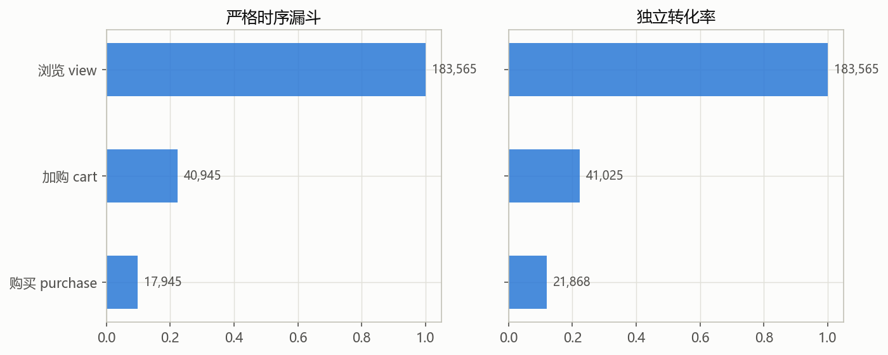
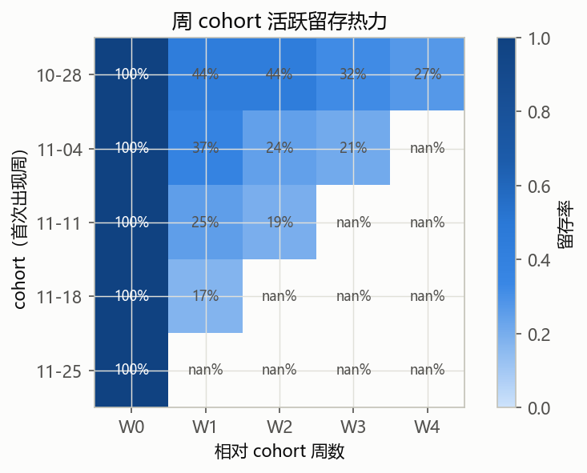
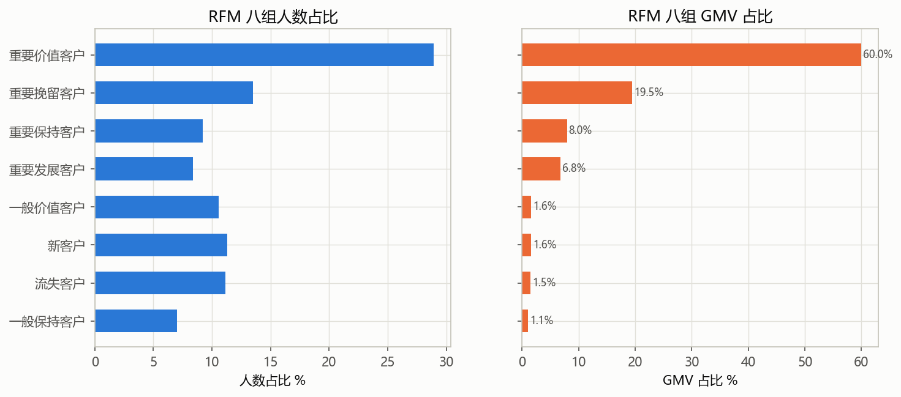
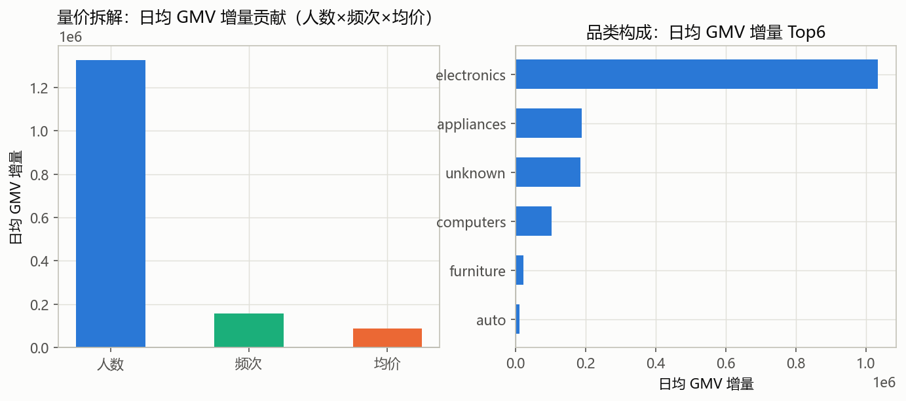

# 电商用户行为分析 · eCommerce Behavior Analysis

> **一句话定位**：对某多品类电商 2019-11 单月数千万行行为日志做「按用户抽样 → OSM 指标体系 → 漏斗/留存/RFM → 大促归因」的完整数据分析，产出 20+ 指标字典、SQL 双轨互验、五模块看板与 8 页分析报告，定位 **electronics 品类 + 购买用户数** 为 GMV 增长主因。

---

## 项目结构

```
ecommerce-behavior-analysis/
├── README.md            # 本文件
├── data/
│   ├── raw/             # 抽样原始数据（parquet）
│   └── processed/       # 清洗后 events/orders/users/daily_metrics
├── notebooks/           # 01~07 分析脚本（.py，含本页结论）
├── src/                 # sample.py 抽样 + loaders.py 读取 + viz.py 图表
├── sql/                 # schema.sql + 必做十题（每题头部写考点）
├── dashboard/           # dashboard_spec.md 五模块布局 + figures/ 图表
├── reports/             # 数据质量报告.md + 分析报告.md（8 页）
└── docs/metrics_dict.md # 指标字典（30+ 指标，公式/维度/示例值）
```

## 核心结论速览

| 指标 | 值 |
|---|---:|
| 整体转化率（购买用户/UV） | 11.91% |
| 严格时序漏斗转化 | 9.78% |
| 购物车放弃率 | 51.7% |
| 复购率 / 平均购买间隔 | 38.15% / 2.08 天 |
| 次日留存 D1 / D7 | 12.79% / 7.08% |
| 高消费人群（M 高，前四组）GMV 占比 | **94.2%** |
| 大促 GMV 暴涨 | **4.5 倍**，主因购买用户数 +84% |

## 关键图表






## 三步复现

```bash
# 1. 安装依赖（Python 3.8+）
pip install pandas==2.0.3 numpy==1.24.4 pyarrow==17.0.0 matplotlib==3.7.5

# 2. 抽样（原始 CSV 已在 ../dataone/，按 user_id 抽 5%，seed=42）
python src/sample.py

# 3. 依序跑分析（清洗 → 指标 → 漏斗 → 留存 → RFM → 专题）
PYTHONIOENCODING=utf-8 python notebooks/02_cleaning.py
PYTHONIOENCODING=utf-8 python notebooks/03_metrics.py
PYTHONIOENCODING=utf-8 python notebooks/04_traffic.py
PYTHONIOENCODING=utf-8 python notebooks/05_retention.py
PYTHONIOENCODING=utf-8 python notebooks/06_rfm.py
PYTHONIOENCODING=utf-8 python notebooks/07_topics.py
```

> 所有随机操作固定 `seed=42`，任何人按上述三步能复现同一份抽样与结论。

## 关键链接

- 📐 [指标字典（30+ 指标）](docs/metrics_dict.md)
- 📊 [看板五模块布局](dashboard/dashboard_spec.md)
- 📄 [8 页分析报告](reports/分析报告.md)
- 🧹 [数据质量报告](reports/数据质量报告.md)
- 🧮 [SQL 必做十题](sql/)
